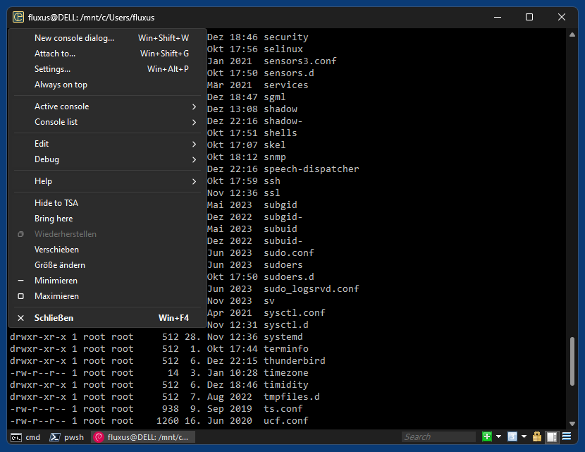
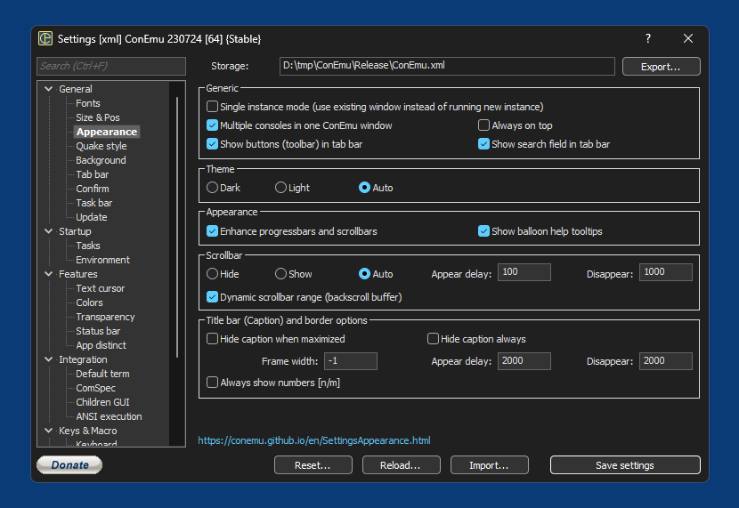
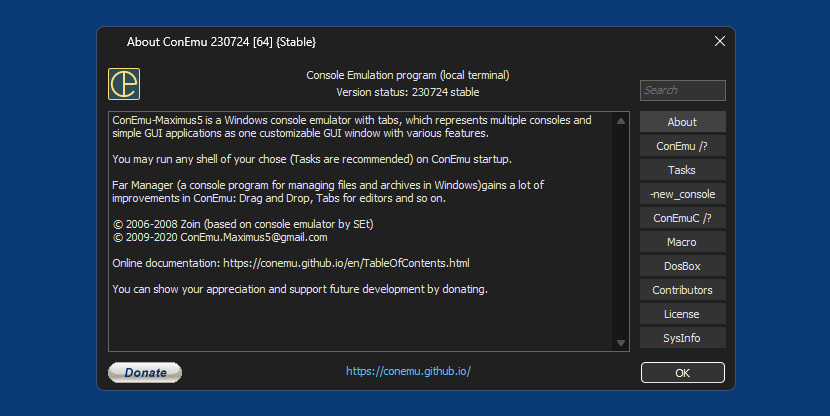

# ConEmuDark

This fork of [ConEmu](https://equalx.sourceforge.io/) adds dark mode/dark theme support (window titlebars, menus, scrollbars, tabbar, dialogs, controls) in Windows 10/11.

## Screenshots
*ConEmuDark in Windows 11*  

*Settings dialog*  

*About dialog*  

## To-do
* Some dialogs still need to be handled
